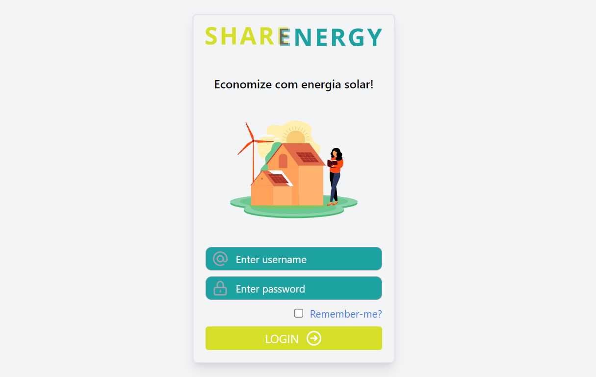

# Sharenergy 

App Sharenergy foi desenvolvido para o Desafio Sharenergy. O backend da aplicação foi feito em Go, o banco de dados utilizado é o MongoDB, o frontend foi feito em React/Typescript e o style foi feito de maneira responsiva utilizando TailWind.

[Youtube video](https://www.youtube.com/watch?v=mVIH3eejXjk) - baixa qualidade

[Loom video](https://www.loom.com/embed/3c4ce86c7f374cd497bdfa77f42a8a3f) - melhor qualidade

[Figma](https://www.figma.com/file/ARcrzpBMGWEPst8Ag89N4s/Projeto-Sharenergy?node-id=0%3A1&t=yxuO9S6NLQTlkN5y-1) - design

## Index

- [Backend - GO lang](#backend---go)
- [Frontend - TYPESCRIPT](#frontend---typescript)
- [Rodando o app](#rodando-a-aplicação)

## Backend - GO

Dependências:

- `gin` - web framework
- `dgrijalva/jwt-go` - gerador de tokens jwt
- `mongo-driver`

Pastas:
- `config/` - atalhos para os conteúdos privados da aplicação;

- `auth/` - arquivos de autenticação e token;

- `database/` - conexão com o banco de dados MongoDB, queries e mutations da aplicação; 

- `models/` - modelos do banco de dados;

- `server/` - handlers das queries e mutations
Dentro dessa pasta, é possível encontrar o arquivo integration.go, que contém os handlers com endpoints externos;

- `types/` - tipos utilizados na aplicação;

- `main.go` - endpoints;

## Frontend - TYPESCRIPT

Dependências:
- `react`
- `typescript`
- `tailwind` - styling
- `prettier` - formatação

Pastas:
- `api/` queries e mutations;

- `assets/` imagens do projeto;

- `components/` tsx components; 

- `configs/` atalhos para o conteúdo privado da aplicação;

- `types/` tipos utilizados na aplicação;

- `main.tsx` Layout e rotas da aplicação;

## Rodando a Aplicação

- Mongo:
  - Inicie o banco de dados MongoDB
  - A configuração do backend espera que ele rodecom as seguintes configurações:
    - Endereço `localhost:27017`;
    - Usuario `root`, senha `root`;
    - Crie um banco chamado `sharenergy`.
  - Se alguma dessas configurações forem diferentes sera necessário alterar `./backend/.env`
- Backend:
  - `cd backend`
  - `go mod tidy` - instala dependências
  - Configure o arquivo `.env` com os links apropriados, configuração padrão deve funcionar.
  - `go test ./...` - rode tests
  - Start:
    - `go run ./...`
    - ou com hotreload:
      - `go install github.com/pilu/fresh@latest`
      - `fresh`
- Frontend
  - `cd frontend/`
  - `npm i`
  - `npm start`
  - `npm run format` - formatação